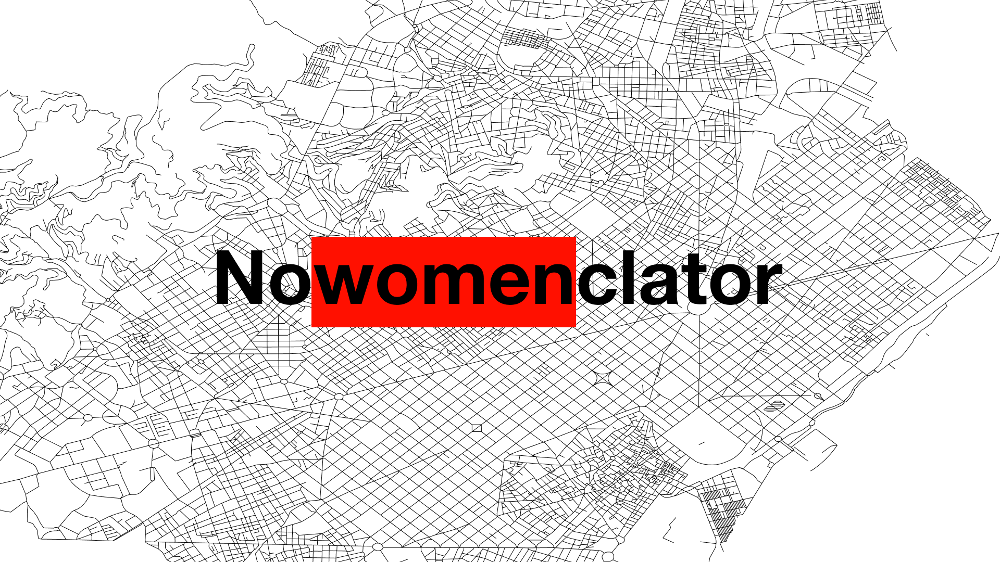

# Nowomenclator
Reporitory for all files used to generate our submission to the World Data Viz Challenge 2020 (Barcelona-Kobe)

# Goals
- Highlight gender inequality in the namings of streets in Barcelona
- A basic forecast of where inequality might be by 2030

# Structure

## design/
This folder contains all the design files used to build the data viz
- `animation.fla` : Adobe Animate source file
- `Nowowenclator.fig` : Figma source file
- `SVG/` : all SVG exports from Figma slides.

## src/
### edaNamesShared3.Rmd
This file will:
- Clean and join the input files
- Extract strings from the streets description
- Query wikidata for any items matching either the extracted strings or the name of the street
- Query wikidata for the gender and birthyear of the items matched
- Append the gender and the birthyear to the data set
- Generate various findings that were needed for our visualisation
- Generate a tidy CSV file (necessary for the submission)
- Download all of the availble wikidata images for matched women
